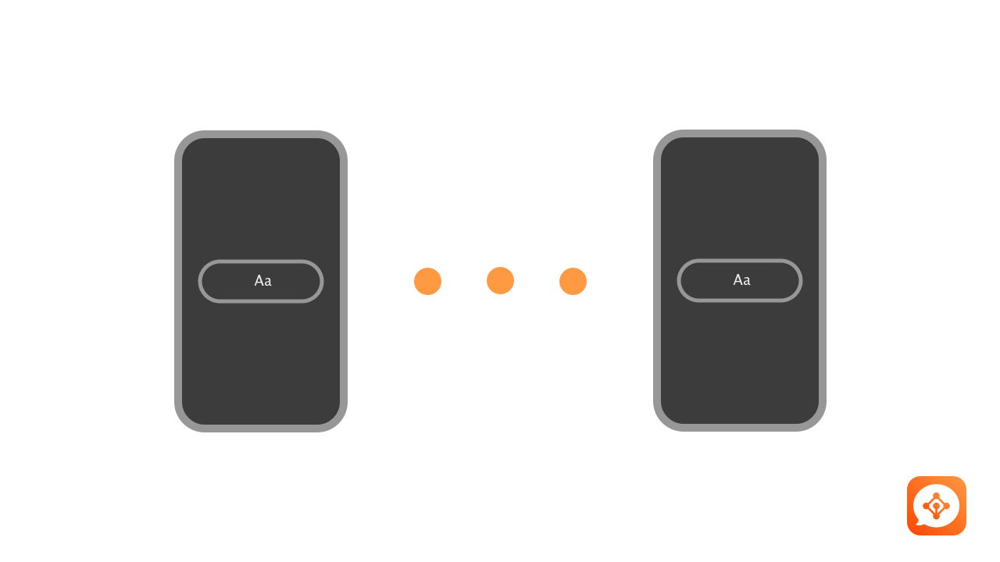
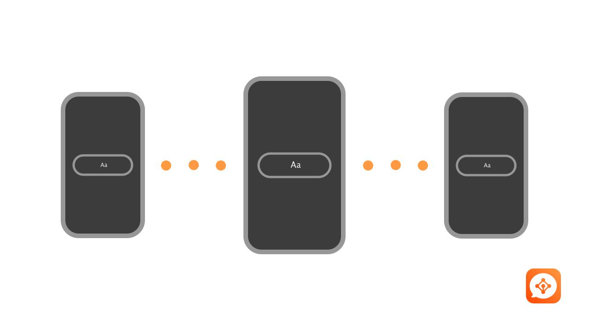

# dIM
### (Decentralised Instant Messenger)

A chat app for iOS which uses Bluetooth to send, receive and route messages.

dIM works by sending messages to nearby users using Bluetooth.

If the user is not available dIM will try to route the message trough other users until the message is received.

